<h1 align="center">Hi 👋, I'm Anuj Saha</h1>

- 🔭 Currently focused on **AI/ML, Deep Learning, Data Science, and Software Development**.
- 🧠 Interested in **Machine Learning, Neural Networks, Medical Imaging, and intelligent data-driven applications**.
- 🌱 Pursuing **B.Tech in Computer Science & Engineering (2023–2027)** at **IIIT Vadodara**.
- 👯 Open to collaborating on **ML/AI, Data Science, and open-source projects**.
- 💻 I enjoy building practical systems that connect **software engineering with machine learning**.
- 📫 Reach me at **anujsahabest0111@gmail.com**
- 😄 Pronouns: **He/Him**
- ⚡ Fun fact: Passionate in exploring new activities and experiences beyond the realm of technology, believing in a well-rounded approach to growth.

<!---
AnujSaha0111/AnujSaha0111 is a ✨ special ✨ repository because its `README.md` (this file) appears on your GitHub profile.
You can click the Preview link to take a look at your changes.
--->
<h2 align="center">Connect with me:</h2>

&nbsp;&nbsp;&nbsp;

&nbsp;&nbsp;&nbsp;

&nbsp;&nbsp;&nbsp;

<h2 align="center">Languages & Tools</h2>

### Languages

  
  &nbsp;&nbsp;
  
  &nbsp;&nbsp;
  
  &nbsp;&nbsp;
  
  &nbsp;&nbsp;
  

### Web Development

  
  &nbsp;&nbsp;
  
  &nbsp;&nbsp;
  
  &nbsp;&nbsp;
  
  &nbsp;&nbsp;
  

### AI / ML & Data

  
  &nbsp;&nbsp;
  
  &nbsp;&nbsp;
  
  &nbsp;&nbsp;
  
  &nbsp;&nbsp;
  

### Tools & Infrastructure

  
  &nbsp;&nbsp;
  
  &nbsp;&nbsp;
  
  &nbsp;&nbsp;
  
  &nbsp;&nbsp;
  
  &nbsp;&nbsp;
  
  &nbsp;&nbsp;
  

<!-- <h2 align="center">📊 GitHub Stats</h2>

  
  

  

 -->

<h2 align="center">📊 GitHub Stats</h2>

  
  

  

